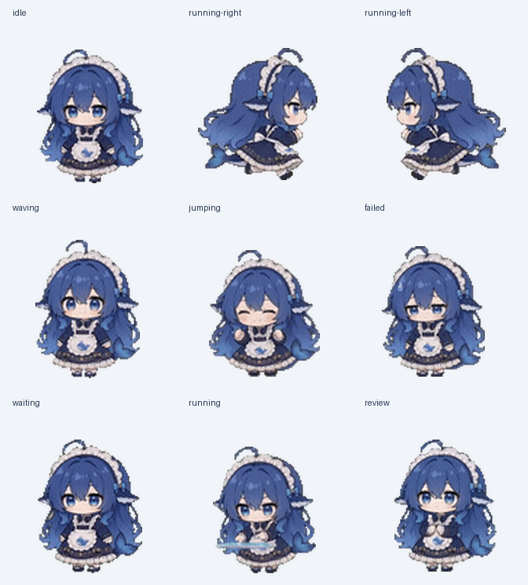

# DeepSeek鲸鱼娘桌宠codex版 · DeepSeek Whale Girl Desktop Pet (Codex Edition)

[中文](#中文) | [English](#english)

## 中文

这是为 Codex 制作的 DeepSeek 鲸鱼娘桌宠。它包含九种标准动画和取自原版转身动画的 16 个转向姿态，并提供可安装文件、预览和完整的状态说明；不包含网站或插件运行时。

### 各动作的形象统一

九种动作和 16 个转身姿态均使用同一套原版角色素材，保留深蓝发色、蓝色眼睛、女仆头饰、深蓝裙子、浅色围裙和原有身体比例。待机和跳跃已替换掉此前风格不同的重绘版本。

所有动作采用相同的源素材缩放比例，并按统一脚底基准线排布；跳跃保留原动画的腾空高度，不会把每帧单独放大或上下居中。发丝高光、背面阴影以及闭眼、微笑仍会随动作变化。

### 功能与触发状态

| Codex 状态 | 图集动画 | 触发方式与表现 |
| --- | --- | --- |
| 默认 / 空闲 | idle | 没有其他状态覆盖时使用；任务结束且结果已读后回到轻微呼吸、眨眼的待机循环。 |
| Codex 唤醒 | waving | Codex 首次唤醒时挥手问候。 |
| 悬停 | jumping | 鼠标指针悬停在宠物上时触发：蹲身、起跳、最高点、下降、落地。Codex 播放三轮后回到待机；鼠标离开宠物区域会立即中断。 |
| 拖动向右 | running-right | 按住并拖动宠物向右移动时播放。 |
| 拖动向左 | running-left | 按住并拖动宠物向左移动时播放。 |
| 任务进行中 | running | Codex 有待处理或正在执行的任务时播放；这是“忙碌 / 正在工作”循环，不表示宠物真的在跑。 |
| 等待你处理 | waiting | Codex 等待用户输入、审批或权限，或等待计划相关操作时播放。 |
| 任务失败或取消 | failed | 任务失败或被取消时显示失落 / 错误反馈。 |
| 有未读完成结果 | review | Codex 已完成一轮工作，但结果尚未读时播放检查结果的动作。 |

状态由 Codex 自动选择。鼠标悬停和拖动是可以直接手动触发的交互；其他状态取决于 Codex 当前任务状态，不需要在 README 中配置快捷键。

### 22.5° 转身

图集提供 16 个方向姿态，供 Codex 按目标点相对宠物的位置选取：上方为 0°，顺时针每 22.5° 一帧。姿态取自原版 360° 转身动画，0° 显示正面、90° 显示右侧、180° 显示背面、270° 显示左侧：

| 角度 | 转身姿态 | 角度 | 转身姿态 |
| ---: | --- | ---: | --- |
| 000° | 正面 | 180° | 背面 |
| 022.5° | 正面稍向右 | 202.5° | 背面稍向左 |
| 045° | 右前侧 | 225° | 左后侧 |
| 067.5° | 接近右侧 | 247.5° | 接近左侧 |
| 090° | 右侧 | 270° | 左侧 |
| 112.5° | 右后侧 | 292.5° | 左前侧 |
| 135° | 接近背面 | 315° | 接近正面 |
| 157.5° | 背面稍向右 | 337.5° | 正面稍向左 |

当前 Codex 版本把应用内目标点（例如编辑器插入点或电脑操作光标）传给方向选择逻辑；它没有把普通鼠标移动位置传给这 16 帧。因此，鼠标绕宠物移动不会让宠物原地转身。方向帧只会在 idle、running、waving 状态显示；悬停触发的 jumping 等状态会覆盖方向帧。宠物图集无法添加鼠标跟随逻辑或修改选帧速度。

### 动画帧与图集布局

图集使用 Codex V2 格式，尺寸为 1536 × 2288 像素；共 8 列 × 11 行，每格 192 × 208 像素。九种标准状态各占一行，最后两行合计 16 个转身姿势。

| 行 | 状态 | 使用帧数 | 单帧显示时间 |
| ---: | --- | ---: | --- |
| 0 | idle | 6 | 280、110、110、140、140、320 ms |
| 1 | running-right | 8 | 前 7 帧各 120 ms，末帧 220 ms |
| 2 | running-left | 8 | 前 7 帧各 120 ms，末帧 220 ms |
| 3 | waving | 4 | 前 3 帧各 140 ms，末帧 280 ms |
| 4 | jumping | 5 | 前 4 帧各 140 ms，末帧 280 ms |
| 5 | failed | 8 | 前 7 帧各 140 ms，末帧 240 ms |
| 6 | waiting | 6 | 前 5 帧各 150 ms，末帧 260 ms |
| 7 | running | 6 | 前 5 帧各 120 ms，末帧 220 ms |
| 8 | review | 6 | 前 5 帧各 150 ms，末帧 280 ms |
| 9–10 | 转身方向 | 16 | 顺时针每 22.5° 一帧 |

pet.json 声明宠物 ID、显示名称、V2 版本号和图集文件名。动画状态及其触发由 Codex 控制。当前客户端固定让 jumping 播放 5 格，前 4 格各 140 ms，最后一格 280 ms；只替换图集无法增加它读取的帧数。新版五格依次采样原版的蹲身、起跳、最高点、下降和落地姿态，第五格保持闭眼落地，不提前插入待机画面。

### 安装到 Codex

将以下文件放到 Codex 宠物目录：

    ~/.codex/pets/dsh-pet-maid/

macOS 或 Linux 可以在仓库目录运行：

    mkdir -p ~/.codex/pets/dsh-pet-maid
    cp pet.json spritesheet.webp NOTICE.md ~/.codex/pets/dsh-pet-maid/

如果你为 Codex 设置了自定义 CODEX_HOME，请把上面的 ~/.codex 替换成该目录。Windows 默认位置为 %USERPROFILE%\.codex\pets\dsh-pet-maid\；创建目录后复制同样三个文件即可。

然后打开 Codex **Settings → Appearance → Pets**，选择 **DeepSeek鲸鱼娘桌宠codex版**。更新已有宠物后，请完全退出并重新打开 Codex，让它重新加载图集。预览图片和动图不需要复制到宠物目录。

### 文件

- pet.json：Codex 宠物清单。
- spritesheet.webp：透明背景的 V2 动画图集。
- preview.png：状态及转身姿态预览图。
- identity-preview.png：九种动作的统一形象预览。
- turn-preview.gif：16 个角度循环预览。
- jumping-preview.gif：重新制作的跳跃动作预览。
- NOTICE.md：来源署名与素材使用说明。

### 校验情况

图集已按 Codex V2 的尺寸、格数、透明背景和清单格式校验。九种动作和转身姿态经过独立的静态视觉复核，发色、服装和比例保持同一角色风格。16 个转身帧来自同一段原版 360° 动画；待机只采样正面呼吸和眨眼，跳跃采样蹲身到落地的动作。转身的末帧切回首帧时，头发仍有轻微摆动差异。这些素材检查不代表已经复核 Codex 窗口中的实时触发和播放。

### 来源与授权

素材署名、来源和使用条件请见 NOTICE.md。分享或展示本桌宠时请保留该文件，并遵守其中的非商业使用要求。

### 分享这个 Git 仓库

本地分发时，可以把 deepseek-whale-girl-pet-codex.bundle 这个 bundle 文件和仓库一起发给接收者。接收者收到 bundle 后运行：

    git clone deepseek-whale-girl-pet-codex.bundle deepseek-whale-girl-pet-codex

若要发布到自己的 GitHub 仓库，先在 GitHub 创建空仓库，再在本仓库运行：

    git remote add origin https://github.com/YOUR_GITHUB_USERNAME/deepseek-whale-girl-pet-codex.git
    git push -u origin main

## English

This is a DeepSeek whale-girl desktop pet for Codex. It includes nine standard animations and 16 turning poses sampled from the original character animation, plus installable files, a preview, and a full state guide. It does not include website or plugin runtime code.

### Consistent character appearance

All nine animations and 16 turning poses use the same original character assets, preserving the deep blue hair, blue eyes, maid headband, dark blue dress, light apron, and original body proportions. Idle and jumping now replace the earlier redrawn versions that had a different style.

Every animation uses the same source-pixel scale and a shared foot baseline. Jumping retains the original airborne height rather than fitting or vertically centering each pose independently. Hair highlights, back-view shadows, blinking, and smiles still change naturally with the pose.

### Features and triggers

| Codex state | Atlas animation | Trigger and behavior |
| --- | --- | --- |
| Default / idle | idle | Used when no other state overrides it; returns to a subtle breathing and blinking loop after a task is finished and its result has been read. |
| Codex wakes | waving | Greets with a wave when Codex first wakes up. |
| Hover | jumping | Starts when the pointer hovers over the pet: crouch, takeoff, apex, descent, and landing. Codex returns to idle after three cycles; leaving the pet area interrupts it immediately. |
| Drag right | running-right | Plays while the pet is held and dragged to the right. |
| Drag left | running-left | Plays while the pet is held and dragged to the left. |
| Task in progress | running | Plays while Codex has a pending or active task. This is a “busy / working” loop, not literal running. |
| Waiting for you | waiting | Plays while Codex awaits user input, approval, or permission, or is waiting on a plan-related action. |
| Task failed or cancelled | failed | Shows a sad or error reaction when a task fails or is cancelled. |
| Unread completed result | review | Plays when Codex has completed a turn but the result has not yet been read. |

Codex selects task states automatically. Hovering and dragging are direct pointer interactions; the other states follow Codex's current task status and do not require shortcut configuration in this repository.

### 22.5° turning

The atlas provides 16 directional poses for Codex to select from a target point relative to the pet: 0° above it, then clockwise in 22.5° steps. The poses are sampled from the original 360° turn animation: 0° shows the front, 90° the right side, 180° the back, and 270° the left side.

| Angle | Facing | Angle | Facing |
| ---: | --- | ---: | --- |
| 000° | Front | 180° | Back |
| 022.5° | Slightly right of front | 202.5° | Slightly left of back |
| 045° | Front-right | 225° | Back-left |
| 067.5° | Near right profile | 247.5° | Near left profile |
| 090° | Right profile | 270° | Left profile |
| 112.5° | Back-right | 292.5° | Front-left |
| 135° | Near back | 315° | Near front |
| 157.5° | Slightly right of back | 337.5° | Slightly left of front |

The current Codex version supplies an in-app target point, such as the editor caret or computer-use cursor, to the direction selector. It does not supply ordinary mouse movement to these 16 frames, so moving the mouse around the pet does not turn it in place. Direction frames appear only during idle, running, and waving; jumping and other states override them. A pet atlas cannot add mouse-tracking logic or change the frame-selection rate.

### Animation frames and atlas layout

The atlas uses the Codex V2 format. It is 1536 × 2288 pixels, arranged as 8 columns × 11 rows of 192 × 208 pixel cells. The nine standard states each occupy one row; the final two rows contain the 16 turning poses.

| Row | State | Used frames | Frame duration |
| ---: | --- | ---: | --- |
| 0 | idle | 6 | 280, 110, 110, 140, 140, 320 ms |
| 1 | running-right | 8 | First 7 frames: 120 ms each; final frame: 220 ms |
| 2 | running-left | 8 | First 7 frames: 120 ms each; final frame: 220 ms |
| 3 | waving | 4 | First 3 frames: 140 ms each; final frame: 280 ms |
| 4 | jumping | 5 | First 4 frames: 140 ms each; final frame: 280 ms |
| 5 | failed | 8 | First 7 frames: 140 ms each; final frame: 240 ms |
| 6 | waiting | 6 | First 5 frames: 150 ms each; final frame: 260 ms |
| 7 | running | 6 | First 5 frames: 120 ms each; final frame: 220 ms |
| 8 | review | 6 | First 5 frames: 150 ms each; final frame: 280 ms |
| 9–10 | Turning poses | 16 | One frame every 22.5° clockwise |

pet.json declares the pet ID, display name, V2 version, and atlas filename. Codex controls animation state selection and triggering. The current client plays exactly five jumping cells: 140 ms each for the first four, then 280 ms for the last. Replacing the atlas alone cannot increase the number of cells it reads. The revised cells sample the original crouch, takeoff, apex, descent, and landing poses. The fifth cell keeps the eyes closed during landing and does not insert an early idle frame.

### Install in Codex

Place the following files in the Codex pets directory:

    ~/.codex/pets/dsh-pet-maid/

On macOS or Linux, run these commands from the repository directory:

    mkdir -p ~/.codex/pets/dsh-pet-maid
    cp pet.json spritesheet.webp NOTICE.md ~/.codex/pets/dsh-pet-maid/

If you set a custom CODEX_HOME, replace ~/.codex above with that directory. On Windows, the default location is %USERPROFILE%\.codex\pets\dsh-pet-maid\; create the folder and copy the same three files there.

Then open Codex **Settings → Appearance → Pets** and select **DeepSeek鲸鱼娘桌宠codex版**. After updating an existing pet, quit Codex completely and reopen it to reload the atlas. Preview images and GIFs do not need to be copied into the pet folder.

### Files

- pet.json: Codex pet manifest.
- spritesheet.webp: transparent V2 animation atlas.
- preview.png: preview of the states and turning poses.
- identity-preview.png: consistent character appearance across the nine animations.
- turn-preview.gif: looping preview of all 16 angles.
- jumping-preview.gif: preview of the revised jumping action.
- NOTICE.md: source attribution and asset use terms.

### Validation

The atlas passed Codex V2 dimension, cell-layout, transparent-background, and manifest checks. An independent static visual review checked the nine animations and turning poses for consistent hair color, clothing, and proportions. The 16 turning frames come from one original 360° animation; idle samples only front-facing breathing and blinking, and jumping samples crouch through landing. A small hair-position difference remains where the last turn frame returns to the first. These asset checks do not verify live triggering or playback inside the Codex window.

### Source and usage terms

See NOTICE.md for asset attribution, source information, and usage terms. Keep that file when sharing or displaying this pet, and follow its non-commercial use requirements.

### Share this Git repository

For local distribution, send the deepseek-whale-girl-pet-codex.bundle file with the repository. After receiving the bundle, the recipient can run:

    git clone deepseek-whale-girl-pet-codex.bundle deepseek-whale-girl-pet-codex

To publish it to your own GitHub repository, create an empty repository on GitHub, then run this from the repository:

    git remote add origin https://github.com/YOUR_GITHUB_USERNAME/deepseek-whale-girl-pet-codex.git
    git push -u origin main
