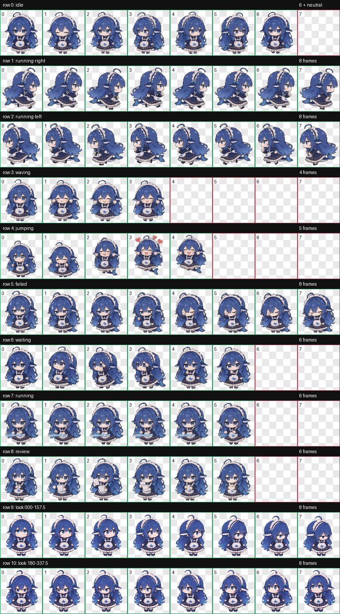

# DeepSeek鲸鱼娘桌宠codex版 · DeepSeek Whale Girl Desktop Pet (Codex Edition)

[中文](#中文) | [English](#english)

## 中文

这是将 [PC2005-cloud/dsh-pet](https://github.com/PC2005-cloud/dsh-pet) 中的 DeepSeek 鲸鱼娘整理成 Codex 可用的桌宠版本。九种标准动画使用上游角色动画素材；Codex V2 图集还包含 16 个注视方向。此仓库提供可安装文件、预览和完整的状态说明，不包含网站或插件运行时。

### 功能与触发状态

| Codex 状态 | 图集动画 | 触发方式与表现 |
| --- | --- | --- |
| 默认 / 空闲 | idle | 没有其他状态覆盖时使用；任务结束且结果已读后回到轻微呼吸、眨眼的待机循环。 |
| Codex 唤醒 | waving | Codex 首次唤醒时挥手问候。 |
| 悬停 | jumping | 鼠标指针悬停在宠物上时触发：蓄势、起跳、落地并恢复。 |
| 拖动向右 | running-right | 按住并拖动宠物向右移动时播放。 |
| 拖动向左 | running-left | 按住并拖动宠物向左移动时播放。 |
| 任务进行中 | running | Codex 有待处理或正在执行的任务时播放；这是“忙碌 / 正在工作”循环，不表示宠物真的在跑。 |
| 等待你处理 | waiting | Codex 等待用户输入、审批或权限，或等待计划相关操作时播放。 |
| 任务失败或取消 | failed | 任务失败或被取消时显示失落 / 错误反馈。 |
| 有未读完成结果 | review | Codex 已完成一轮工作，但结果尚未读时播放检查结果的动作。 |

状态由 Codex 自动选择。鼠标悬停和拖动是可以直接手动触发的交互；其他状态取决于 Codex 当前任务状态，不需要在 README 中配置快捷键。

### 注视方向

宠物会根据鼠标相对位置切换到最近的注视角度。角度从正上方开始顺时针计算，每 22.5° 一个姿势：

| 角度 | 注视方向 | 角度 | 注视方向 |
| ---: | --- | ---: | --- |
| 000° | 上 | 180° | 下 |
| 022.5° | 右上 | 202.5° | 左下 |
| 045° | 右上 | 225° | 左下 |
| 067.5° | 右上 | 247.5° | 左下 |
| 090° | 右 | 270° | 左 |
| 112.5° | 右下 | 292.5° | 左上 |
| 135° | 右下 | 315° | 左上 |
| 157.5° | 右下 | 337.5° | 左上 |

指针处于宠物正前方的中性死区时使用普通 idle，而不是把 000° 当成正脸。16 个方向按一圈连续排列。

### 动画帧与图集布局

图集使用 Codex V2 格式，尺寸为 1536 × 2288 像素；共 8 列 × 11 行，每格 192 × 208 像素。九种标准状态各占一行，最后两行合计 16 个注视姿势。

| 行 | 状态 | 使用帧数 | 单帧显示时间 |
| ---: | --- | ---: | --- |
| 0 | idle | 6 | 280、110、110、140、140、320 ms |
| 1 | running-right | 8 | 前 7 帧各 120 ms，末帧 220 ms |
| 2 | running-left | 8 | 前 7 帧各 120 ms，末帧 220 ms |
| 3 | waving | 4 | 前 3 帧各 140 ms，末帧 280 ms |
| 4 | jumping | 5 | 前 4 帧各 140 ms，末帧 280 ms |
| 5 | failed | 8 | 前 7 帧各 140 ms，末帧 240 ms |
| 6 | waiting | 6 | 前 5 帧各 150 ms，末帧 260 ms |
| 7 | running | 6 | 前 5 帧各 120 ms，末帧 220 ms |
| 8 | review | 6 | 前 5 帧各 150 ms，末帧 280 ms |
| 9–10 | 注视方向 | 16 | 按顺时针角度连续排列 |

pet.json 声明宠物 ID、显示名称、V2 版本号和图集文件名。动画状态及其触发由 Codex 控制。

### 安装到 Codex

将以下文件放到 Codex 宠物目录：

    ~/.codex/pets/dsh-pet-maid/

macOS 或 Linux 可以在仓库目录运行：

    mkdir -p ~/.codex/pets/dsh-pet-maid
    cp pet.json spritesheet.webp NOTICE.md ~/.codex/pets/dsh-pet-maid/

如果你为 Codex 设置了自定义 CODEX_HOME，请把上面的 ~/.codex 替换成该目录。Windows 默认位置为 %USERPROFILE%\.codex\pets\dsh-pet-maid\；创建目录后复制同样三个文件即可。

然后打开 Codex **Settings → Appearance → Pets**，选择 **DeepSeek鲸鱼娘桌宠codex版**。preview.png 用于仓库预览，不需要复制到宠物目录。

### 文件

- pet.json：Codex 宠物清单。
- spritesheet.webp：透明背景的 V2 动画图集。
- preview.png：状态及视线方向预览图。
- NOTICE.md：来源署名与素材使用说明。

### 校验情况

图集已按 Codex V2 的尺寸、格数和清单格式校验，独立视觉检查通过。个别中间对角注视方向有轻微辨识度提示；四个主方向及整体方向循环通过检查。

### 来源与授权

角色和动画素材来源于 [PC2005-cloud/dsh-pet](https://github.com/PC2005-cloud/dsh-pet)，基准提交为 631c5310b047931404978152fdc7865413c153ec。分享或展示时请保留 NOTICE.md 并注明来源。上游说明将代码标为 MIT，但动画素材和提示词仅允许开源使用并禁止商业使用；这不代表本仓库内的角色图像可按 MIT 商用。详情请以 [上游仓库说明](https://github.com/PC2005-cloud/dsh-pet) 为准。

### 分享这个 Git 仓库

本地分发时，可以把 deepseek-whale-girl-codex.bundle 这个 bundle 文件和仓库一起发给接收者。接收者收到 bundle 后运行：

    git clone deepseek-whale-girl-codex.bundle deepseek-whale-girl-codex

若要发布到自己的 GitHub 仓库，先在 GitHub 创建空仓库，再在本仓库运行：

    git remote add origin https://github.com/YOUR_GITHUB_USERNAME/deepseek-whale-girl-codex.git
    git push -u origin main

## English

This repository adapts the DeepSeek whale-girl character from [PC2005-cloud/dsh-pet](https://github.com/PC2005-cloud/dsh-pet) as a custom GPT pet for Codex. Its nine standard animations use the upstream character animation assets. The Codex V2 atlas also includes 16 gaze directions. This repository contains the installable files, a preview, and a full state guide; it does not contain the website or a plugin runtime.

### Features and triggers

| Codex state | Atlas animation | Trigger and behavior |
| --- | --- | --- |
| Default / idle | idle | Used when no other state overrides it; returns to a subtle breathing and blinking loop after a task is finished and its result has been read. |
| Codex wakes | waving | Greets with a wave when Codex first wakes up. |
| Hover | jumping | Starts when the pointer hovers over the pet: anticipation, jump, landing, and recovery. |
| Drag right | running-right | Plays while the pet is held and dragged to the right. |
| Drag left | running-left | Plays while the pet is held and dragged to the left. |
| Task in progress | running | Plays while Codex has a pending or active task. This is a “busy / working” loop, not literal running. |
| Waiting for you | waiting | Plays while Codex awaits user input, approval, or permission, or is waiting on a plan-related action. |
| Task failed or cancelled | failed | Shows a sad or error reaction when a task fails or is cancelled. |
| Unread completed result | review | Plays when Codex has completed a turn but the result has not yet been read. |

Codex selects task states automatically. Hovering and dragging are direct pointer interactions; the other states follow Codex's current task status and do not require shortcut configuration in this repository.

### Gaze directions

The pet chooses the nearest gaze angle based on the pointer's position relative to the pet. Angles start at the top and increase clockwise, with one pose every 22.5 degrees:

| Angle | Gaze | Angle | Gaze |
| ---: | --- | ---: | --- |
| 000° | Up | 180° | Down |
| 022.5° | Up-right | 202.5° | Down-left |
| 045° | Up-right | 225° | Down-left |
| 067.5° | Up-right | 247.5° | Down-left |
| 090° | Right | 270° | Left |
| 112.5° | Down-right | 292.5° | Up-left |
| 135° | Down-right | 315° | Up-left |
| 157.5° | Down-right | 337.5° | Up-left |

When the pointer is in the neutral dead zone directly in front of the pet, Codex uses the normal idle animation; 000° is not used as a front-facing pose. The 16 poses form one clockwise loop.

### Animation frames and atlas layout

The atlas uses the Codex V2 format. It is 1536 × 2288 pixels, arranged as 8 columns × 11 rows of 192 × 208 pixel cells. The nine standard states each occupy one row; the final two rows contain the 16 gaze poses.

| Row | State | Used frames | Frame duration |
| ---: | --- | ---: | --- |
| 0 | idle | 6 | 280, 110, 110, 140, 140, 320 ms |
| 1 | running-right | 8 | First 7 frames: 120 ms each; final frame: 220 ms |
| 2 | running-left | 8 | First 7 frames: 120 ms each; final frame: 220 ms |
| 3 | waving | 4 | First 3 frames: 140 ms each; final frame: 280 ms |
| 4 | jumping | 5 | First 4 frames: 140 ms each; final frame: 280 ms |
| 5 | failed | 8 | First 7 frames: 140 ms each; final frame: 240 ms |
| 6 | waiting | 6 | First 5 frames: 150 ms each; final frame: 260 ms |
| 7 | running | 6 | First 5 frames: 120 ms each; final frame: 220 ms |
| 8 | review | 6 | First 5 frames: 150 ms each; final frame: 280 ms |
| 9–10 | Gaze directions | 16 | Continuous clockwise angle sequence |

pet.json declares the pet ID, display name, V2 version, and atlas filename. Codex controls animation state selection and triggering.

### Install in Codex

Place the following files in the Codex pets directory:

    ~/.codex/pets/dsh-pet-maid/

On macOS or Linux, run these commands from the repository directory:

    mkdir -p ~/.codex/pets/dsh-pet-maid
    cp pet.json spritesheet.webp NOTICE.md ~/.codex/pets/dsh-pet-maid/

If you set a custom CODEX_HOME, replace ~/.codex above with that directory. On Windows, the default location is %USERPROFILE%\.codex\pets\dsh-pet-maid\; create the folder and copy the same three files there.

Then open Codex **Settings → Appearance → Pets** and select **DeepSeek鲸鱼娘桌宠codex版**. preview.png is for the repository and does not need to be copied into the pet folder.

### Files

- pet.json: Codex pet manifest.
- spritesheet.webp: transparent V2 animation atlas.
- preview.png: preview of the states and gaze directions.
- NOTICE.md: source attribution and asset use terms.

### Validation

The atlas passed Codex V2 dimension, cell-layout, and manifest checks, and passed independent visual review. A few intermediate diagonal gaze directions have minor readability notes; the four cardinal directions and the overall direction loop passed review.

### Source and usage terms

The character and animation assets come from [PC2005-cloud/dsh-pet](https://github.com/PC2005-cloud/dsh-pet), based on commit 631c5310b047931404978152fdc7865413c153ec. Keep NOTICE.md and credit the source when sharing or displaying this package. The upstream repository identifies its code as MIT licensed, but its animation assets and prompts are allowed for open-source use and prohibited for commercial use. This does not make the character artwork in this repository available for commercial use under MIT. See the [upstream repository](https://github.com/PC2005-cloud/dsh-pet) for its terms.

### Share this Git repository

For local distribution, send the deepseek-whale-girl-codex.bundle file with the repository. After receiving the bundle, the recipient can run:

    git clone deepseek-whale-girl-codex.bundle deepseek-whale-girl-codex

To publish it to your own GitHub repository, create an empty repository on GitHub, then run this from the repository:

    git remote add origin https://github.com/YOUR_GITHUB_USERNAME/deepseek-whale-girl-codex.git
    git push -u origin main
